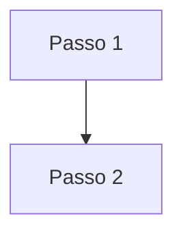

# [Título legível]

**Tipo:** rule | skill  
**Slug:** `artifact-slug`  
**Categoria:** [categoria dinâmica]  
**Caminho no repositório:** `.cursor/...`

## Distribuição Arqueosfera

**Pacote:** Pacote delivery (padrão Arqueosfera) | Pacote optional (sob demanda)

Skills e rules deste pacote podem ser consultadas no catálogo do workspace (Settings → Agent artifacts) ou via MCP `list_agent_artifacts` / `get_agent_artifact`.

### Rules e skills relacionadas

| Artefato | Tipo | Relação |
|----------|------|---------|
| related-slug | rule \| skill | Instalar junto / Handoff / … |

## Para que serve

[Comportamento concreto em português — o que o agente faz, proíbe ou exige. Inclua tools/APIs quando relevante. Para rules curtas sem `##`, resuma aqui a lista numerada ou o parágrafo inicial do artefato.]

**Exemplo (rule logbook):** Preserva o histórico do projeto: append com `append_logbook_entry` (uma chamada por evento); nunca `logbook.entries` em `update_project`; `update_logbook_entry` só para typo; após `upsert_wbs_artifact`, append separado com resumo de uma linha.

**Evite:** "Rule Cursor sempre aplicada ou sob demanda para orientar o agente em …" — isso não explica o comportamento.

## Índice do conteúdo

Para cada seção, o motivo em português simples — o **porquê** da regra ou orientação, não o passo a passo técnico. Detalhes de implementação ficam no código-fonte (em inglês).

| Seção | Por que existe |
|-------|----------------|
| [Título H2 em PT] | [Motivo — por que esta seção existe; não copiar EN nem listar passos] |
| ↳ [Subseção H3 em PT] | [Motivo curto — o porquê, não o como] |

_Artefatos sem `##`/`###`: omita a tabela e use — _Artefato curto sem seções — consulte o código-fonte integral abaixo.__

## Visão geral (diagrama)

_Inclua quando houver workflow, handoffs, dependências ou ≥3 seções H2._



## Dependências

| Artefato | Tipo | Relação |
|----------|------|---------|
| clean-code | rule | Referenciado no texto |

_Se vazio:_ _Nenhuma dependência obrigatória._

## Templates e arquivos de apoio

| Arquivo | Propósito | Quando usar |
|---------|-----------|-------------|
| feature-spec-template.md | Modelo de documento | Ao redigir nova funcionalidade |

_Se vazio:_ _Este artefato não referencia templates externos._

## Código-fonte

```markdown
[cole aqui o conteúdo integral do SKILL.md ou .mdc, incluindo frontmatter YAML]
```
