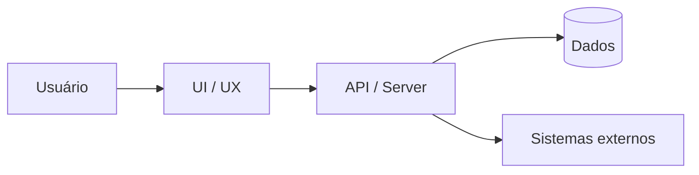
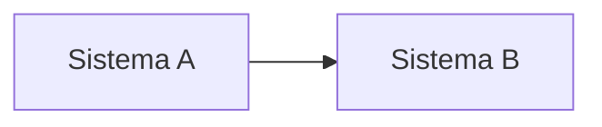
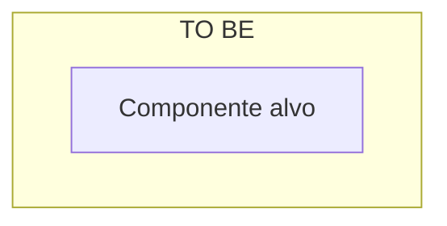
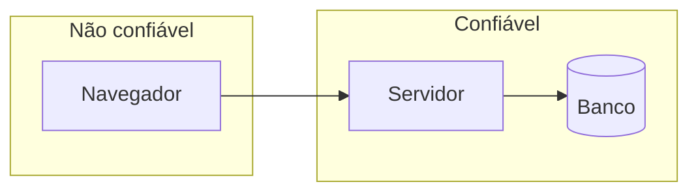

# Design Doc — [Nome da funcionalidade / iniciativa]

**Data:** YYYY-MM-DD  
**Autor:** [PM / arquitetura / joint]  
**Status:** Rascunho | Em revisão | **Aprovado para implementação** | Superseded by [link]  
**Projeto Archsphere:** [nome / id]  
**WBS child (quando aplicável):** [ex.: TO BE specification approved]

---

## Checklist visual *(obrigatório antes de aprovar)*

- [ ] ≥ **3 diagramas Mermaid** integrados (D1 end-to-end, D2 jornada ou D3 AS IS/TO BE, + D4/D5 se aplicável)
- [ ] Diagramas upstream (AN, AS, UX, security) **embutidos ou resumidos** — §4–§6 não só bullets
- [ ] Cada diagrama com *Leitura:* acima do bloco
- [ ] §0 referencia diagrama principal para leitores visuais

Ver catálogo: [design-doc/SKILL.md § Visual documentation](../design-doc/SKILL.md)

---

## Documentos relacionados

| Documento | Caminho / artifact id | Status |
|-----------|----------------------|--------|
| Feature spec | [link ou N/A — ver §2] | |
| UX spec | [link ou N/A — ver §3] | |
| Parecer / TO BE | [link ou N/A — ver §5] | |
| Security assessment | [link ou N/A — ver §6] | |
| ADR | [ADR-xxx ou N/A] | |

---

## 0. Resumo executivo *(obrigatório)*

**Em uma frase — o que estamos construindo:**

**Problema / oportunidade:**

**Decisão principal deste doc:**

**Recomendação / direção aprovada:**

**Principal trade-off ou risco:**

**Próximo passo após aprovação:**

---

## 0.1 Mapa visual integrado *(obrigatório)*

*Leitura: [feature ponta a ponta em uma frase]*

*(Incluir D2–D5 conforme escopo — ver checklist visual no topo)*

---

## 1. Contexto e escopo

### 1.1 Objetivo de negócio

| Métrica de sucesso | Baseline | Meta |
|--------------------|----------|------|
| | | |

### 1.2 Usuários e personas

| Persona | Necessidade |
|---------|-------------|
| | |

### 1.3 Escopo

| Incluído | Excluído |
|----------|----------|
| | |

### 1.4 Premissas e dependências

| Tipo | Descrição | Owner |
|------|-----------|-------|
| Premissa | | |
| Dependência externa | | |

---

## 2. Produto *(PM — ou link para feature-spec)*

> Se já existe feature spec separada, resuma aqui e link. Mantenha FR ids estáveis para QA e dev.

### 2.1 Cenário principal (happy path)

1.
2.
3.

### 2.2 Requisitos funcionais

| ID | Requisito | Prioridade | Notas |
|----|-----------|------------|-------|
| FR-1 | | Must | |

### 2.3 Requisitos não funcionais

| ID | Requisito | Alvo mensurável |
|----|-----------|-----------------|
| NFR-1 | ex.: latência p95 | < 300 ms |
| NFR-2 | ex.: auditoria | log imutável |

### 2.4 User stories (backlog)

| ID | Título | Prioridade | Task Archsphere |
|----|--------|------------|-----------------|
| US-1 | | P1 | |

---

## 3. Experiência *(UX — se houver UI; senão marcar N/A)*

> Detalhe completo no UX spec. Aqui: click budget, referência visual, inventário de telas.

**Click budget (happy path):** [N cliques para outcome]

**Referência visual:** [telas existentes a espelhar]

### 3.1 Inventário de superfícies

| ID | Tela / componente | Estados críticos |
|----|-------------------|------------------|
| SCR-1 | | empty, loading, error |

### 3.2 Fluxos

**Happy path:** [passos ou link § UX spec 4.1]

**Erros / edge cases:** [resumo]

### 3.3 Copy deck *(opcional — labels principais)*

| Elemento | Texto |
|----------|-------|

---

## 4. Arquitetura de negócio *(se fronteira ou capability em disputa)*

> Omitir se ownership já está claro. Usar [business-architecture assessment](../business-architecture/assessment-template.md).

| Capability | Owner AS IS | Owner TO BE | Gap |
|------------|-------------|-------------|-----|
| | | | |

**Decisão de fronteira:**

---

## 5. Solução *(arquitetura — AS IS / TO BE)*

> Parecer completo pode viver em artifact separado. Esta seção deve permitir **implementar sem reler 40 páginas**.

### 5.1 Resumo em linguagem simples

[3–5 linhas: o que muda na prática por sistema/área]

### 5.2 Glossário

| Termo | Significado |
|-------|-------------|
| | |

### 5.3 AS IS (situação atual)

[Fluxos, sistemas, acoplamentos relevantes]

*Leitura do diagrama:* [uma frase]

### 5.4 TO BE (situação alvo)

[Comportamento desejado, integrações, responsabilidades]

*Leitura do diagrama TO BE:* [uma frase]

*(Reutilizar C4 Container do parecer quando existir)*

### 5.5 Opções consideradas *(≥2 se houve decisão relevante)*

| Opção | Em uma frase | Prós | Contras |
|-------|--------------|------|---------|
| A | | | |
| B | | | |

**Recomendação:** [Opção X — porque]

### 5.6 Decisões registradas

| ID | Decisão | Status | ADR / data |
|----|---------|--------|------------|
| DEC-1 | | Aprovada | |

---

## 6. Segurança *(se auth, MCP, API, PII, compliance)*

> Assessment completo em artifact security-architecture quando necessário.

| Ameaça | Controle / mitigação | Residual |
|--------|----------------------|----------|
| | | |

**Trust boundaries:** [quem autentica, quem autoriza, o que não expor]

*Leitura:* [zonas de confiança em uma frase]

---

## 7. Design de implementação *(handoff dev)*

### 7.1 Modelo de dados

| Entidade / tabela | Campos novos ou alterados | Migração |
|-------------------|---------------------------|----------|
| | | sim / não |

### 7.2 API / contratos

| ID | Método / evento | Contrato | Consumidor |
|----|-----------------|----------|------------|
| API-1 | POST /… | [schema ou link OpenAPI] | |

**Idempotência / retry / versionamento:**

### 7.3 Comportamento offline / batch / async *(se aplicável)*

| Job / fila | Trigger | SLA |
|------------|---------|-----|

### 7.4 Rollout e feature flags

| Fase | O que entrega | Critério de avanço | Rollback |
|------|---------------|--------------------|----------|
| ROL-1 | Platô / MVP | | |

### 7.5 Observabilidade

| Sinal | Onde | Alerta |
|-------|------|--------|

---

## 8. Verificação *(QA)*

| FR / NFR | Estratégia de teste | Automatizado? |
|----------|---------------------|---------------|
| FR-1 | | sim — unit / e2e |
| NFR-1 | | load test |

**Critérios de aceite de release:**

- [ ]
- [ ]

---

## 9. Plano de entrega

| Marco | Entregável | Owner | Data alvo |
|-------|------------|-------|-----------|
| M1 | Design doc aprovado | | |
| M2 | MVP / platô | | |
| M3 | Rollout completo | | |

**Mapa story → design doc:**

| Story | Seções relevantes | Corpo da tarefa |
|-------|-------------------|-----------------|
| US-1 (implementação) | §2 FR-1, §7.2 API-1, §3 SCR-1 | Caso de uso + **especificação técnica** completa |
| US-2 (alinhamento) | §5, logbook | Caso de uso + **entregáveis leves** |

---

## 10. Decisões em aberto

| # | Decisão | Responsável | Prazo | Bloqueia |
|---|---------|-------------|-------|----------|
| 1 | | | | US-x |

---

## 11. Histórico de revisões

| Versão | Data | Autor | Mudança |
|--------|------|-------|---------|
| 0.1 | | | Rascunho inicial |

---

## Checklist de aprovação

- [ ] §0 resumo compreensível por gestor não técnico
- [ ] **≥3 diagramas Mermaid** integrados (checklist visual)
- [ ] FR ids estáveis e testáveis (§2)
- [ ] UX click budget e estados se UI (§3)
- [ ] TO BE e decisão clara (§5)
- [ ] Security preenchido ou explicitamente N/A (§6)
- [ ] API / dados / rollout suficientes para dev (§7)
- [ ] Stories registradas no Archsphere com refs a este doc (§2.4)
- [ ] Artifact WBS salvo + logbook (integração)
