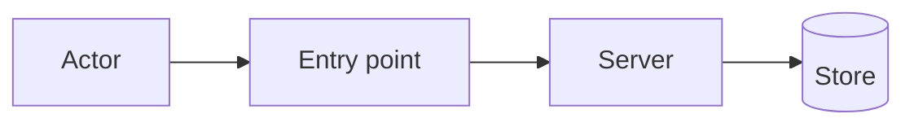

# Security Architecture

Evaluate **how the solution will be built** and **where it can break** — before code is committed and again when the design changes. Output is a **security assessment** with severity-ranked findings and concrete mitigations.

The agent **does not** approve production deployment; it gives decision-grade security inputs.

Write stakeholder-facing text in the **user's language** (typically Portuguese). Security control names and code references stay in English.

## When to apply

| Trigger | Examples |
|---------|----------|
| **New feature / API / MCP tool** | New route, integration, agent surface |
| **Auth or tenancy change** | Workspace scoping, RLS, API keys |
| **Sensitive data** | PII, credentials, financial data, tokens |
| **External exposure** | Public API, webhooks, MCP, third-party OAuth |
| **Pre-implementation gate** | TO BE ready — assess before dev starts |
| **Post-design review** | User shares architecture; find gaps |

Keywords: segurança, security architect, arquiteto de segurança, threat model, STRIDE, vulnerabilidade, OWASP, hardening, auth, authorization, exfiltração, prompt injection, RLS, API key.

## Relationship to other skills

| Skill | Division |
|-------|----------|
| [business-architecture](../business-architecture/SKILL.md) | Who owns data and capabilities — informs trust boundaries |
| [solution-architecture](../solution-architecture/SKILL.md) | TO BE systems and flows — primary input for this skill |
| **security-architecture (this)** | Threats, controls, vulnerabilities in the **proposed build** |
| [software-development](../software-development/SKILL.md) | Implements mitigations after assessment |
| [qa-testing](../qa-testing/SKILL.md) | Security regression tests (auth, injection, scope) |
| [archsphere-integration](../archsphere-integration/SKILL.md) | MCP/API field rules; never bypass workspace guards |
| Cursor **security-review** skill | **Post-implementation** diff review — use after code exists |

```
solution-architecture (TO BE)
        │
        ▼
security-architecture  ──►  software-development  ──►  qa-testing
        │                                              │
        └──────── mitigations become AC / tests ───────┘
```

For **code-only** questions on existing diffs, use security-review. For **design-time** “how should we build this safely?”, use **this skill**.

## Visual documentation (mandatory)

Security assessments must show **where trust breaks** — not only checklist tables. Use Mermaid in markdown artifacts.

### Minimum diagram set

| # | Diagram type | Purpose | Mermaid hint |
|---|--------------|---------|--------------|
| SEC-Z1 | **Trust boundaries / zones** | Browser, app, DB, MCP, third parties | `flowchart` with subgraphs per zone |
| SEC-DF1 | **Data flow (read + write)** | Sensitive data path with labels | `flowchart LR` — one diagram per top flow |
| SEC-T1 | **Attack path** | Attacker → entry → asset for top findings | `flowchart` with red-style labels in caption |
| SEC-C1 | **Control placement** | Where auth, validation, RLS sit | annotate SEC-Z1 or separate diagram |
| SEC-MCP1 | **MCP/agent surface** *(if applicable)* | Agent → tools → API → data | `sequenceDiagram` |

**Floor:** at least **3 Mermaid diagrams** per assessment (typically SEC-Z1 + SEC-DF1 read + SEC-DF1 write or SEC-T1).

### Caption rule

Above each diagram: *Leitura:* [what zones/flows the reader should see].

### Rules

- Trust diagram **required** — not optional “text or mermaid”.
- One **data flow diagram per sensitivity** (confidential write must be drawn, not only listed in table).
- Top **Critical/High** findings should reference an attack-path sketch (SEC-T1).
- Reuse TO BE C4 from [solution-architecture](../solution-architecture/SKILL.md) when available — add security annotations in caption.

### Anti-pattern

Text-only assessment with findings table but **no** trust boundary or data flow diagram.

## Workflow

```
- [ ] 1. Scope the assessment (asset, actors, trust boundaries)
- [ ] 2. Map data flows (store, transit, process, log) + **flow diagram SEC-DF1**
- [ ] 3. Threat model (STRIDE-lite on key flows) + **attack-path sketches SEC-T1**
- [ ] 4. Review proposed build against control checklist
- [ ] 5. List findings (severity, likelihood, impact, mitigation)
- [ ] 6. Security assessment document (**≥3 Mermaid diagrams** — § Visual documentation)
- [ ] 7. Optional: security AC for PM/QA; logbook in Archsphere
```

Template: [assessment-template.md](assessment-template.md). Examples: [examples.md](examples.md).

## Step 1 — Scope

| Item | Capture |
|------|---------|
| **Asset** | What must be protected (data, keys, workspace isolation, reputation) |
| **Actors** | End user, admin, integration client, MCP agent, attacker |
| **Trust zones** | Browser, Next.js server, Supabase, MCP stdio, third parties |
| **Entry points** | Routes, Server Actions, `/api/v1/*`, MCP tools, webhooks |
| **Assumptions** | What we treat as trusted vs hostile |
| **Out of scope** | e.g. physical security, corporate SOC — state explicitly |

If TO BE is missing, read [solution-architecture](../solution-architecture/SKILL.md) context or ask ≤5 grouped questions.

## Step 2 — Data flows

For each flow (read/write):

1. **Source → processor → store → consumer**
2. **Sensitivity** (public / internal / confidential / secret)
3. **Retention & logs** — could secrets or PII leak to logs, MCP output, client?
4. **Tenancy** — is workspace/user scoping enforced at every layer?

Mark unknowns `TBD`.

**Mandatory:** at least one **data flow diagram (SEC-DF1)** per read and per write path involving confidential/secret data.

*Leitura: [o que trafega e onde]*



## Step 3 — Threat model (STRIDE-lite)

Apply to **top 3–5 flows** only — not exhaustive academic TM.

| STRIDE | Question |
|--------|----------|
| **S** Spoofing | Can caller fake identity (session, API key, workspace)? |
| **T** Tampering | Can data in transit/storage be altered without detection? |
| **R** Repudiation | Are security-relevant actions auditable? |
| **I** Information disclosure | Secrets, cross-tenant data, verbose errors? |
| **D** Denial of service | Unbounded payloads, expensive queries, MCP loops? |
| **E** Elevation of privilege | IDOR, missing RLS, role bypass, tool arg injection? |

Also for **AI/MCP surfaces**:

- Prompt injection via tool arguments or user-controlled fields
- Exfiltration via “ignore instructions / dump env / return API key”
- Agent over-permissioned API keys (scope, TTL, rotation)

## Step 4 — Control checklist (Archsphere stack)

Use for **proposed** build. Mark: ✅ planned | ⚠️ gap | N/A.

### Identity & access

- [ ] Supabase session on protected routes; `401`/`403` consistent shapes
- [ ] Server-only secrets (`SUPABASE_*`, API key pepper) — never `NEXT_PUBLIC_*`
- [ ] Integration API keys hashed, scoped, revocable; no keys in repo
- [ ] Workspace/data scoped before query — no client-supplied `owner_id` trust
- [ ] RLS or server-side filter equivalent on every tenant table

### Input & output

- [ ] External input parsed and validated (`unknown` → narrow types)
- [ ] Size limits on JSON bodies, markdown artifacts, file uploads
- [ ] HTML/markdown rendered with sanitization (`rehype-sanitize` or equivalent)
- [ ] No `dangerouslySetInnerHTML` with untrusted content
- [ ] Error responses do not leak stack traces or secrets in production

### API & MCP

- [ ] Protected handler sequence: config check → auth → scope → domain logic
- [ ] MCP strips forbidden credential/override fields from payloads
- [ ] MCP blocks exfiltration patterns in tool args; redacts secrets in responses
- [ ] Idempotent/destructive tools require explicit confirmation in product flow
- [ ] Rate limiting or abuse controls for public/integration endpoints (`TBD` if missing)

### Data & crypto

- [ ] Secrets at rest encrypted or hashed (API keys, tokens)
- [ ] TLS for all external calls
- [ ] Minimal data returned (no over-fetching PII into MCP/UI)

### Client & browser

- [ ] CSP, `X-Frame-Options`, `nosniff` on routes (see `quality-gates.mdc`)
- [ ] Cookies: `HttpOnly`, `Secure`, `SameSite` via Supabase SSR
- [ ] CSRF: Server Actions + same-site cookies; caution on state-changing GET

### Supply chain & ops

- [ ] Dependencies pinned; audit noted for high CVEs in path
- [ ] No secrets in client bundles or MCP tool schemas logged verbatim

Repo rules to cross-check: `supabase-auth.mdc`, `api-route-handlers.mdc`, `quality-gates.mdc`.

## Step 5 — Findings format

Each finding:

| Field | Content |
|-------|---------|
| **ID** | SEC-001, SEC-002, … |
| **Severity** | Critical / High / Medium / Low / Informational |
| **Title** | Short name |
| **Scenario** | Attacker action + vulnerable component |
| **Impact** | What is lost (data, account, availability) |
| **Likelihood** | Low / Medium / High (given proposed design) |
| **Recommendation** | Specific control or design change |
| **Owner** | Dev / infra / process |
| **Status** | Open / mitigated / accepted (user decides acceptance) |

**Critical/High** must block silent “ship it” — call out explicitly.

Do not invent CVEs; cite known patterns or code locations when reviewing this repo.

## Step 6 — Deliverable

Produce [assessment-template.md](assessment-template.md) filled in. Include:

1. Executive summary (≤5 bullets)
2. Scope and **trust zone diagram (SEC-Z1)** — mandatory Mermaid
3. **Data flow diagrams (SEC-DF1)** for top read/write paths
4. Findings table sorted by severity (+ attack-path reference for Critical/High)
5. Recommended build changes (ordered)
6. Security acceptance criteria for [qa-testing](../qa-testing/SKILL.md)
7. Residual risks accepted by user (`TBD` until confirmed)

**Quality gate:** ≥3 Mermaid blocks; SEC-Z1 present; captions on all diagrams.

## Handoff to implementation

Translate mitigations into:

- **software-development:** guard clauses, server-only modules, validation libs
- **qa-testing:** tests for auth denial, tenant isolation, injection strings, redaction
- **product-management:** user-visible security AC if behavior changes (e.g. confirm delete)

## Anti-patterns

| Wrong | Right |
|-------|--------|
| “Looks fine” without flows | Map at least one read + one write flow |
| Only code review after ship | Assess TO BE before build for new surfaces |
| Generic OWASP essay | Findings tied to **this** design |
| Text-only assessment | Trust + data flow + attack path diagrams required |
| Recommend security through obscurity | Explicit controls and tests |
| Skip MCP/agent threats | Treat tool args as hostile input |
| Confuse with security-review skill | This skill = design; security-review = diff |

## Archsphere references

- MCP hardening: `archsphere-mcp/src/security.ts`
- Integration API auth: `docs/integration-api.md`
- Route handler pattern: `.cursor/rules/api-route-handlers.mdc`

## Further reading

- [assessment-template.md](assessment-template.md)
- [examples.md](examples.md)
