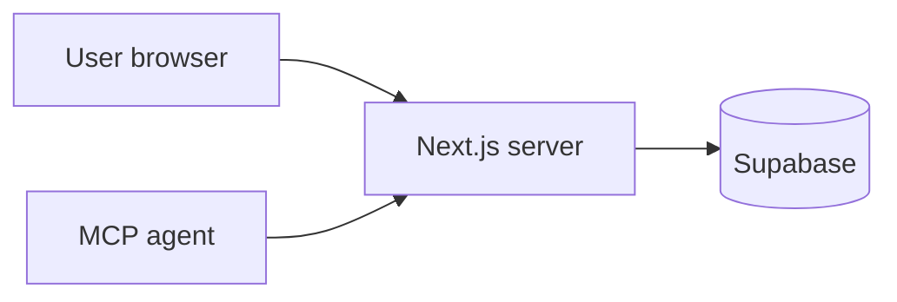
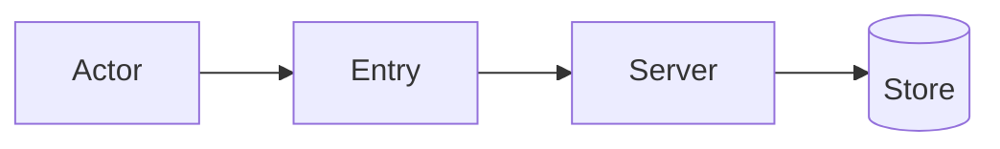
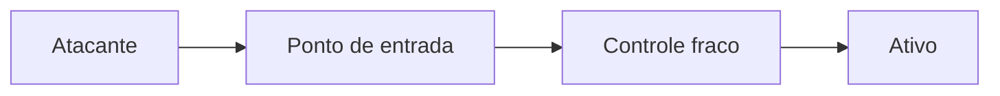

# Security architecture assessment — {title}

**Date:** {YYYY-MM-DD}  
**Assessor:** Security architecture (agent)  
**Status:** Draft | For review | Approved with residual risk  
**Related:** {project / ADR / feature link}

---

## Checklist visual *(obrigatório antes de publicar)*

- [ ] **SEC-Z1** — diagrama de zonas de confiança (Mermaid)
- [ ] **SEC-DF1** — fluxo de dados read + write para dados sensíveis
- [ ] **SEC-T1** — caminho de ataque para achados Critical/High (se houver)
- [ ] Cada diagrama com *Leitura:* acima do bloco
- [ ] ≥ **3 diagramas Mermaid** no total

Ver catálogo: [security-architecture/SKILL.md § Visual documentation](../security-architecture/SKILL.md)

---

## 1. Executive summary

- {Bullet 1 — overall risk posture: Low / Medium / High}
- {Bullet 2 — highest severity finding or “no Critical/High identified”}
- {Bullet 3 — key mitigation before build}
- {Bullet 4 — decision needed from user}
- {Bullet 5 — optional residual risk}

---

## 2. Scope

| Item | Value |
|------|--------|
| **Decision / feature** | |
| **Assets** | |
| **Actors** | |
| **Entry points** | |
| **Trust boundaries** | |
| **Out of scope** | |

### Trust diagram *(obrigatório SEC-Z1)*

*Leitura: [zonas e fronteiras em uma frase]*

---

## 3. Data flows

| Flow | Sensitivity | Path | Controls today | Gaps |
|------|-------------|------|----------------|------|
| | | | | |

### Data flow diagrams *(obrigatório SEC-DF1 para read/write sensíveis)*

*Leitura — leitura:* [fluxo em uma frase]

*Leitura — escrita:* [fluxo em uma frase]

---

## 4. Threat model (summary)

| Flow | Threat (STRIDE) | Scenario | Mitigation proposed |
|------|-----------------|----------|---------------------|
| | | | |

### Attack path *(SEC-T1 — para achados Critical/High)*

*Leitura: [como o atacante alcança o ativo]*

---

## 5. Findings

| ID | Sev | Title | Impact | Likelihood | Recommendation | Status |
|----|-----|-------|--------|------------|----------------|--------|
| SEC-001 | | | | | | Open |

### SEC-001 — {title}

**Severity:**  
**Component:**  
**Scenario:**  
**Impact:**  
**Recommendation:**  
**Verification (QA):**  

---

## 6. Recommended build changes (priority order)

1. 
2. 
3. 

---

## 7. Security acceptance criteria (for QA / PM)

- [ ] 
- [ ] 
- [ ] 

---

## 8. Residual risk (user acceptance)

| Risk | Accepted by | Date | Notes |
|------|-------------|------|-------|
| | TBD | | |

---

## 9. Next steps

| Action | Owner | When |
|--------|-------|------|
| | | |
