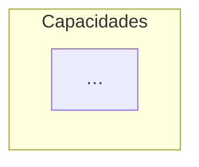
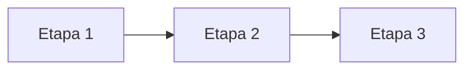
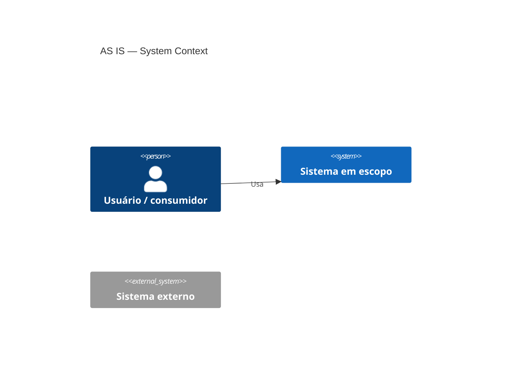
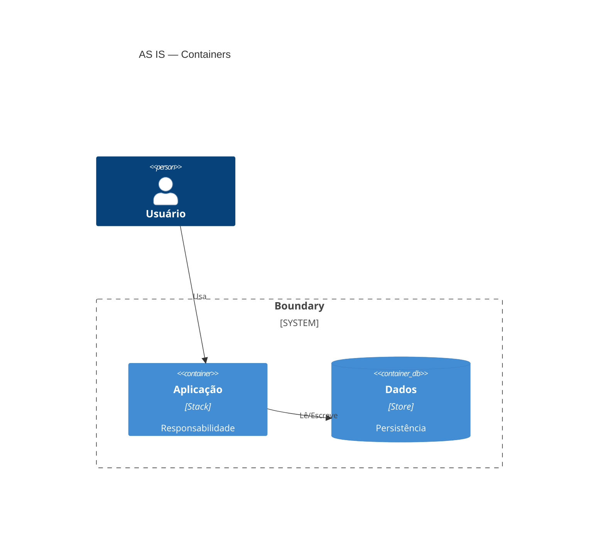
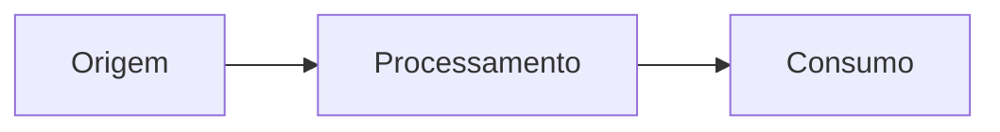
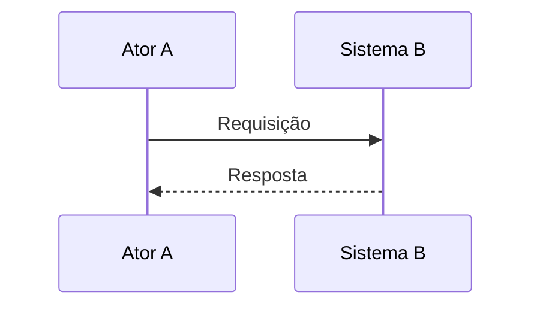
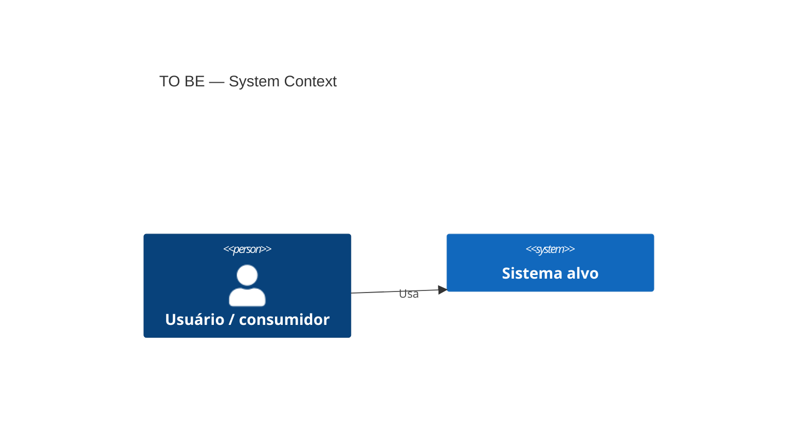
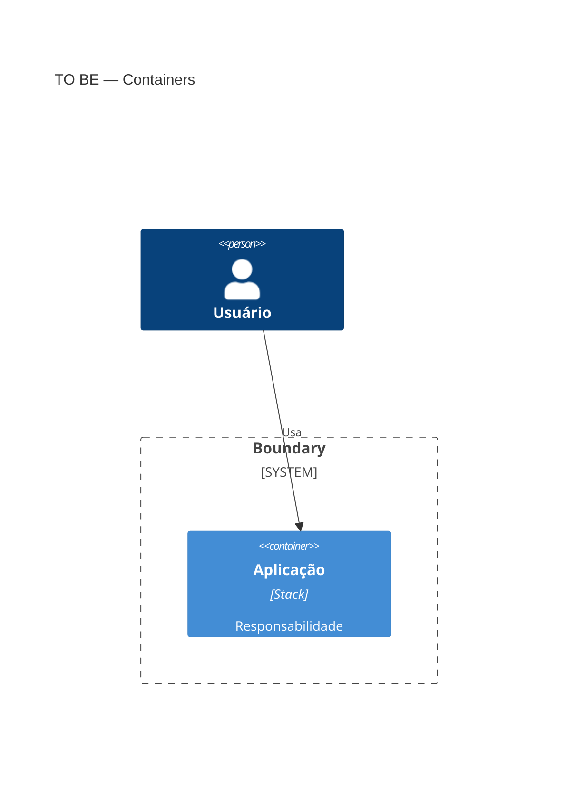
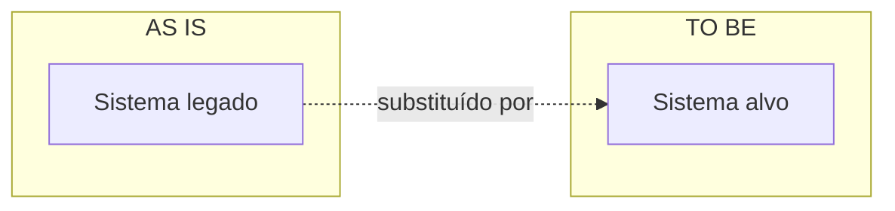
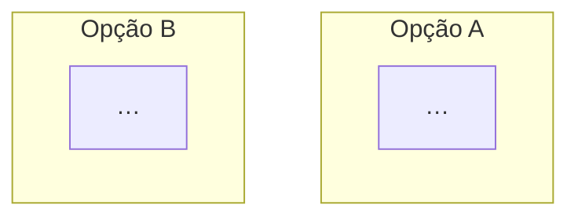

# Parecer de Arquitetura — [Título]

**Data:** YYYY-MM-DD  
**Elaborado para:** [Solicitante / comitê / fórum]  
**Cenário:** [ ] Nova implementação  [ ] Evolução/migração  [ ] Disputa de ownership  [ ] Revisão de ADR  
**Status:** Rascunho | Para discussão | Recomendação final

---

## Checklist visual *(obrigatório antes de publicar)*

- [ ] ≥ **4 diagramas Mermaid** (TO BE C4 Context + Container + fluxos)
- [ ] AS IS C4 *(S2–S4)* quando houver landscape existente
- [ ] Fluxograma de integração ou sequência *(S5)* se cross-system
- [ ] Mini-caixograma por opção arquitetural *(S8)* ou comparativo único
- [ ] Cada diagrama com *Leitura do diagrama:* acima do bloco
- [ ] §3 reutiliza diagramas de AN (capability, value stream) — não só bullets

Ver catálogo completo: [solution-architecture/SKILL.md § Visual documentation](../solution-architecture/SKILL.md)

---

## Resumo em linguagem simples *(obrigatório — ler primeiro)*

[5–10 linhas: decisão, contexto, opções em uma linha cada, recomendação, principal risco se não decidir]

---

## Glossário *(obrigatório)*

| Termo | Significado em linguagem simples |
|-------|----------------------------------|
| | |

---

## 1. Decisão solicitada

**O que precisa ser decidido agora:**

[Uma frase clara — ex.: "Quem provê duration?", "Build interno vs integrar capability X?", "Aprovar TO BE da plataforma Y"]

**Motivador de negócio:** [por que agora, valor esperado]

**Critérios de sucesso:**
1.
2.
3.

**Stakeholders:** [times / papéis]

*(Disputas / ADR: incluir histórico e conflito abaixo)*

**Histórico / ADR:** [opcional — data, decisão anterior]

**Conflito ou gap atual:** [opcional]

**Transição / ferramenta legada *(opcional)*:** [ex.: SAC **é** a precificação IS hoje; Corretora já saiu; migrar SAC → nova peça (duration); ADR desatualizado]

---

## 2. Escopo

| Incluído | Excluído |
|----------|----------|
| | |

**Restrições:** [prazo, regulatório, legado, orçamento, skills]

---

## 3. Arquitetura de negócio

### 3.1 Capacidade em escopo

- Tipo: [ ] Capacidade de negócio  [ ] Suporte  [ ] Cálculo/métrica  [ ] Plataforma compartilhada  [ ] Responsabilidade local de domínio

### 3.2 Mapa de capacidades / value stream

*Leitura: [negócio em uma frase]*

*(Importar diagramas completos do artefato business_architecture quando existirem.)*

### 3.3 Ownership e critérios

| Critério | Avaliação |
|----------|-----------|
| Dono do dado de entrada | |
| Dono do produto/decisão | |
| Quem opera build/run | |
| Necessidade de SLA cross-domain | |
| Segmentação por contexto (se aplicável) | |

---

## 4. Arquitetura de solução

### 4.1 AS IS *(evolução/disputa — omitir se greenfield puro)*

**Sistemas:** [siglas/plataformas]

#### C4 — Context (AS IS)

#### C4 — Container (AS IS)

**Fluxo resumido (obrigatório quando integração cross-system):**

*Leitura do diagrama: [ordem de chamadas / eventos]*

*(Opcional — sequência detalhada)*

**Dores / gaps:**

-

### 4.2 TO BE *(nova implementação ou direcionamento)*

**Visão lógica alvo:**

#### C4 — Context (TO BE)

#### C4 — Container (TO BE)

**Integrações:** [API, ESB, batch, eventos]

*Leitura do diagrama TO BE: [visão de containers e fluxo principal]*

**Dados:** [fontes, master, replicação]

**NFRs relevantes:** [escala, latência, disponibilidade, auditoria]

*(Opcional — delta AS IS → TO BE)*

---

## 5. Opções analisadas

*Leitura comparativa: [como as opções diferem em uma frase]*

### Opção A — [Nome]

**Em uma frase:** [resumo para leigo — obrigatório]

**Descrição:**

**Prós:**
-

**Contras:**
-

**Impacto:** [times/sistemas] | **Esforço/risco:** [baixo/médio/alto]

---

### Opção B — [Nome]

**Em uma frase:** [resumo para leigo — obrigatório]

**Descrição:**

**Prós:**
-

**Contras:**
-

**Impacto:** | **Esforço/risco:**

---

### Opção C — [Nome] *(recomendada, evolutiva, híbrida, etc.)*

**Em uma frase:** [resumo para leigo — obrigatório]

**Descrição:**

**Prós:**
-

**Contras:**
-

**Impacto:** | **Esforço/risco:**

---

## 6. Comparativo (decision dimensions)

| Dimensão | Opção A | Opção B | Opção C |
|----------|---------|---------|---------|
| Fit estratégico | | | |
| Time to value | | | |
| TCO (qualitativo) | | | |
| Risco técnico | | | |
| Acoplamento | | | |
| Reversibilidade | | | |
| Compliance | | | |

---

## 7. Recomendação

**Direcionamento recomendado:** [Opção X]

**Em uma frase (para leigos):** [uma sentence que um diretor pode repetir na reunião]

**Por que (em linguagem simples):**
1.
2.
3.

**Fundamentação técnica:**

-

**Condições / premissas:**

-

**Explicitamente fora desta decisão:**

-

**Ação de governança:** [ ] N/A  [ ] Manter ADR  [ ] Revisar  [ ] Substituir  [ ] Novo ADR

---

## 7.1 O que muda na prática *(obrigatório)*

| Área / sistema | Hoje | Depois da decisão |
|----------------|------|-------------------|
| | | |

*Leitura dos diagramas:* [1 frase por diagrama principal — o que o leigo deve entender]

---

## 8. Decisões para o solicitante

Lista objetiva do que **você** precisa validar ou escolher:

1. [ ] …
2. [ ] …
3. [ ] …

---

## 9. Próximos passos

| # | Ação | Responsável sugerido | Prazo |
|---|------|----------------------|-------|
| 1 | | | |
| 2 | | | |

---

## 10. Riscos e pendências

| Risco / pendência | Mitigação |
|-------------------|-----------|
| | |

**TBD:** [itens a confirmar com stakeholders]

---

## 11. Registro *(opcional)*

- Projeto Archsphere: [nome / id]
- Logbook: [data]
