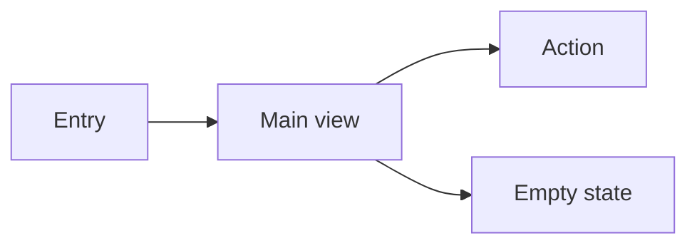
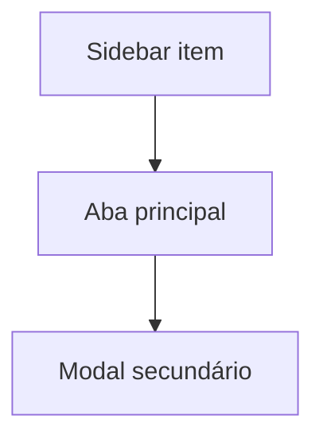

# UX Design (Interface & Experience)

Own **how the feature feels and behaves** for users. Deliver a **UX specification** devs can implement without guessing layout, states, or copy.

Works **after or with** [product-management](../product-management/SKILL.md) (what/why) and **before or during** dev implementation. Does not replace architecture for integration/backend.

Write UX artifacts in the **user's language** (typically Portuguese). Microcopy and labels follow product language.

## Visual documentation (mandatory)

UX specs must be **visual-first**: devs and stakeholders understand layout and flow from **diagrams and wireframes**, not only prose.

### Minimum diagram set (deliver all that apply)

| # | Diagram type | Purpose | Format |
|---|--------------|---------|--------|
| U1 | **User journey / happy path** | Entry → outcome with click count | `flowchart LR` or `TB` |
| U2 | **Screen map / IA** | Routes, tabs, modals — shallow navigation | `flowchart` or ASCII site map |
| U3 | **State diagram** | loading / empty / error / success per SCR | `stateDiagram-v2` when ≥3 states |
| U4 | **Branching flow** | Filters, permissions, destructive confirm | `flowchart` with decision diamonds |
| U5 | **Wireframe block** | Layout regions per primary screen | ASCII box art in spec or canvas |

**Floor:** at least **2 visual artifacts** per UX spec — typically **U1 journey + U5 wireframe** (or U2 IA for multi-screen features).

### Caption rule

Above each Mermaid block: *Leitura:* [uma frase — o que o usuário vê e faz].

### Rules

- **Do not** rely on prose-only happy path when the flow has ≥2 screens or branches — draw U1.
- **Wireframes required** for new tabs, modals, or patterns not copied 1:1 from an existing screen.
- **Canvas** for high-fidelity when layout is ambiguous; still include U1 journey in markdown spec.
- Match [business-architecture](../business-architecture/SKILL.md) / [solution-architecture](../solution-architecture/SKILL.md) naming when UX touches integrations (same actor/system labels).

### Anti-pattern: text-only UX spec

Reject delivery with no Mermaid, no ASCII wireframe, and no canvas link for any **new** surface.

## Core principles (non-negotiable)

Every UX proposal must optimize for **simplicity**, **few clicks**, and **visual cohesion** with the app.

### 1 — Simple navigation

| Rule | Application |
|------|-------------|
| **Shallow IA** | Prefer 1–2 levels to complete the task; avoid deep menu trees |
| **Context over hops** | Show related content on the same screen (tabs, sections, expand) instead of new routes |
| **No maze** | If happy path needs >3 navigational steps, **redesign** before spec |
| **Predictable entry** | Reuse existing nav patterns (sidebar, project tabs, board views) |
| **Wayfinding** | Breadcrumb/title only when user can land from deep link — not as crutch for bad IA |

Reject flows that force: list → detail → sub-detail → modal → confirm for a single outcome.

### 2 — Minimal clicks

Target **click budget** per primary task (state in UX spec):

| Task type | Target clicks (happy path) |
|-----------|----------------------------|
| Read / view | 0–1 (visible by default or one tab) |
| Edit single field | 1–2 (inline or one modal) |
| Create record | 2–3 (open form → save) |
| Bulk / admin | justify each extra step |

**Tactics:** defaults pre-filled, inline edit, primary action on same page, expand-in-place vs navigate, sensible defaults, keyboard shortcuts only when app already uses them, avoid confirmation dialogs unless destructive.

Document in spec: `Click budget: N clicks to [outcome]`.

### 3 — Application aesthetics

UX owns **look and feel** within the existing design system — not a separate visual language.

| Dimension | Requirement |
|-----------|-------------|
| **Design system** | Reuse tokens (`--bg`, `--surface`, `--accent`, `--border`, `--radius`) and BEM patterns (`.btn--primary`, `.field__*`, tabs, cards) |
| **Consistency** | Match spacing, typography, and component behavior of adjacent screens — **grep similar UI before spec** |
| **Hierarchy** | Clear title → supporting hint → content → actions; one visual focal point |
| **Density** | Balanced — neither cramped nor wasteful whitespace; scannable lists and labels |
| **Theme** | Light/dark via existing `[data-theme]` — no hardcoded colors in spec |
| **Polish** | States feel intentional (hover/focus/disabled); no raw unstyled controls in spec |

Spec must include **Visual reference**: name 1–2 existing screens to mirror (e.g. "Logbook tab layout + Links tab actions").

**Canvas prototypes** must follow app aesthetic: flat, minimal, token-based — align with `css-design-system` and canvas skill (no gradient slop).

## When to apply (mandatory for UI features)

Apply whenever a feature includes **any** user-facing interface:

| Surface | Examples |
|---------|----------|
| **New screen / tab** | Project Artifacts tab, settings panel |
| **Form or wizard** | Create project, edit WBS item |
| **Dashboard / board** | Kanban, Eisenhower, analytics |
| **Modal / drawer** | Confirm delete, task editor |
| **Empty / error / loading** | New list views, API failure |
| **Responsive / mobile** | Tab swipe, collapsed nav |

Keywords: UX, UI, interface, tela, fluxo, wireframe, protótipo, mockup, usabilidade, acessibilidade, jornada, experiência.

**Skip deep UX pass** only when change is purely API/backend with no UI delta — say so explicitly.

## Relationship to other skills

| Skill | Division |
|-------|----------|
| [product-management](../product-management/SKILL.md) | User stories, FRs, backlog tasks |
| **ux-design (this)** | Flows, layout, interaction, copy, a11y, prototype |
| [solution-architecture](../solution-architecture/SKILL.md) | Systems, APIs, NFRs at platform level |
| Cursor **canvas** skill | Interactive prototype in IDE when visual proof helps — read `~/.cursor/skills-cursor/canvas/SKILL.md` |
| [software-development](../software-development/SKILL.md) | UX spec + acceptance criteria → code (clean code, immutability, tests) |

**Handoff to dev:** PM story + **UX spec** (this skill) + [software-development](../software-development/SKILL.md) when implementing.

## Workflow

```
- [ ] 1. Understand users and job-to-be-done
- [ ] 2. Map flow and IA (shallow — validate click budget; **diagram U1 + U2**)
- [ ] 3. Define interaction, states, and visual reference (**U3/U5 wireframes**)
- [ ] 4. Prototype (if needed — canvas for high fidelity)
- [ ] 5. Write UX spec for developers (**≥2 visual artifacts**)
- [ ] 6. Align with PM stories / Archsphere tasks
- [ ] 7. Optional: register spec or prototype link in Archsphere
```

### Step 1 — Context

| Item | Question |
|------|----------|
| **Primary user** | Persona from PM spec |
| **Job-to-be-done** | What are they trying to accomplish in one session? |
| **Context of use** | Desktop vs mobile, frequency, expertise |
| **Constraints** | Design system, existing patterns, deadline |
| **Success** | Task completion time, errors avoided, clarity |

Reuse PM feature spec when available — do not re-interview from zero.

### Step 2 — Flow & IA

Document:

1. **Entry points** — where user starts (nav, deep link, action)  
2. **Happy path** — numbered steps screen-by-screen  
3. **Click budget** — count clicks/taps on happy path; flag if > target (see Core principles)  
4. **Alternates** — cancel, back, edit, filter (each must add minimal depth)  
5. **Edge cases** — empty, partial data, permission denied  

**Navigation check:** if proposing a new route or modal layer, explain why inline/tab pattern is insufficient.

**Mandatory:** user journey diagram (U1) on every UX spec. Add IA diagram (U2) when ≥2 routes/tabs; state diagram (U3) when SCR has non-trivial async/error paths.

*Leitura: [fluxo principal em uma frase]*



*(Opcional — mapa de telas / IA)*



**Information architecture:** what appears on each screen (sections, hierarchy, primary vs secondary actions).

### Step 3 — Interaction & states

For **each screen or component**, specify:

| Dimension | Dev must know |
|-----------|----------------|
| **Layout** | Regions, order, grouping (not pixel-perfect unless critical) |
| **Visual reference** | Existing screen(s) to match for aesthetics |
| **Primary action** | One obvious CTA |
| **Secondary actions** | Ghost buttons, overflow menu |
| **Feedback** | Toast, inline validation, progress |
| **States** | default, loading, empty, error, success, disabled, read-only |
| **Keyboard** | Focus order, Enter/Escape, shortcuts if any |
| **a11y** | Labels, roles, aria-live for async, contrast note |
| **Copy** | Titles, hints, buttons, errors — **exact strings** when finalized |

**Heuristics:**

- One primary action per view  
- **Fewest clicks** — merge steps; default to visible content  
- **Same screen when possible** — tabs/accordion over new pages  
- Destructive actions need confirmation pattern consistent with app  
- Empty states explain **what** and **next step**  
- Errors say what failed and what user can do  
- Prefer progressive disclosure over long forms or wizard chains  
- **Look like the rest of the app** — never spec a one-off visual style  

### Step 4 — Prototype (when needed)

Create a prototype when:

- Layout or flow is **ambiguous** from text alone  
- **New pattern** not in existing UI  
- Stakeholder needs to **validate** before dev  
- Multiple valid UX options — prototype the recommended one  

| Fidelity | Use when |
|----------|----------|
| **Low** | ASCII / annotated wireframe in UX spec — small tweak, obvious pattern |
| **Medium** | Structured markdown + mermaid + screen inventory |
| **High (interactive)** | **Cursor canvas** — multi-step flow, layout review, stakeholder demo |

**Canvas rules:** read the **canvas** skill (`~/.cursor/skills-cursor/canvas/SKILL.md`) before creating `.canvas.tsx` mockups.

**Archsphere app features:** when implementing in-repo, reference existing patterns:

- BEM classes: `.btn--primary`, `.field__label`, `.projects-proto__tab`  
- Tokens via CSS variables (`--bg`, `--accent`, `--border`) — see `css-design-system` rule  
- Reuse components from nearby screens (tabs, lists, modals) — **grep before inventing**

Do **not** prototype if existing screen + short spec is enough.

### Step 5 — UX spec for developers

Use [ux-spec-template.md](ux-spec-template.md). This is the **mandatory handoff** for UI work.

Must include:

- Screen inventory with states table  
- **≥2 visual artifacts** (journey U1 + wireframe U5 or IA U2) — see § Visual documentation  
- **Click budget** per primary flow  
- **Visual reference** (screens/components to mirror)  
- Copy deck (labels, messages)  
- Interaction notes per component  
- Responsive behavior (breakpoints if non-obvious)  
- Acceptance criteria **UX-focused** (visible behavior, not implementation)  
- Link to prototype (canvas path or wireframe section) if any  
- **Out of scope for UX** — what dev can decide vs fixed  

Dev should implement **without** choosing layout or default copy on their own.

### Step 6 — Align with PM backlog

Map UX spec sections to user stories:

| UX screen / flow | PM story / FR |
|------------------|---------------|
| Artifacts tab list | US-1 |
| Download .md | US-2 |

Add to **task descriptions** (via PM or `update_task`):

```markdown
## UX specification
See UX spec section 3.2 — Artifacts tab.
- Empty state: copy from UX spec § Copy deck
- Primary: expand artifact; secondary: download .md
```

UX acceptance criteria **supplement** PM criteria — do not duplicate entire spec in every task; reference section ids.

### Step 7 — Archsphere (optional)

| Artifact | When |
|----------|------|
| **WBS artifact** | Full UX spec markdown **with embedded diagrams** — `upsert_wbs_artifact`, `kind: other` |
| **Design doc §3** | Complex feature — UX summary lives in [design-doc](../design-doc/SKILL.md); link UX spec id in § Documentos relacionados |
| **Task updates** | UX AC block in implementation stories |
| **Logbook** | "UX spec approved for [feature]" — one line |

See [archsphere-integration](../archsphere-integration/SKILL.md).

## UX acceptance criteria (examples)

Write testable from user perspective:

- [ ] Dado projeto sem artefatos, quando abro a aba Artefatos, então vejo mensagem orientativa e **não** vejo botões de download desabilitados sem explicação.  
- [ ] Dado teclado, quando navego com Tab, então ordem de foco segue: título → ações do card → conteúdo expandível.  
- [ ] Dado erro de rede ao expandir artefato, então vejo mensagem inline no card (não apenas toast genérico).

## Anti-patterns

- **Deep navigation** — wizard chains, hub-and-spoke with 4+ hops, modal stacked on modal  
- **Click tax** — extra confirm, redundant "Next", navigate away when inline would work  
- **Visual orphan** — new colors, spacing, or button styles inconsistent with app  
- Handing dev only a user story with no layout or states  
- Prototype without spec — dev needs written rules for edge cases  
- Inventing new visual language when app pattern exists  
- Ignoring empty/loading/error states  
- Placeholder copy ("Lorem", "Título aqui") in final spec  
- UX spec that dictates database schema or API design — stay in presentation layer  
- **Text-only UX spec** — no journey diagram, wireframe, or canvas for new surfaces  
- Canvas for trivial button label change  
- Gradients, decorative chrome, or dense dashboards when a simple list suffices  

## Additional resources

- Template: [ux-spec-template.md](ux-spec-template.md)  
- Complex features: [design-doc](../design-doc/SKILL.md) — §3 Experience  
- Examples: [examples.md](examples.md)  
- PM backlog: [product-management](../product-management/SKILL.md)
