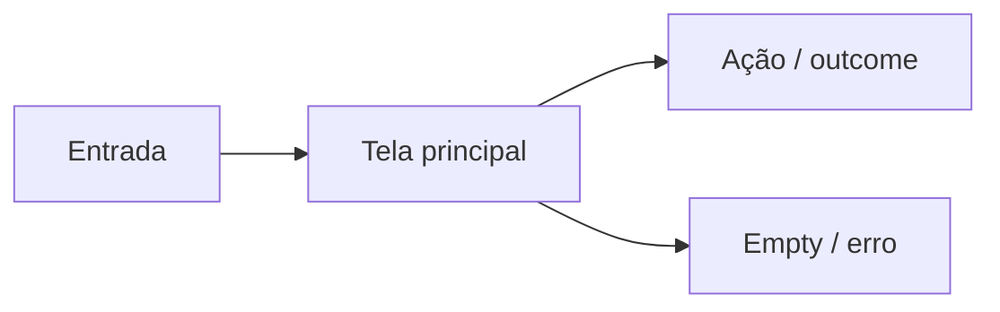

# Especificação UX — [Nome da funcionalidade]

**Data:** YYYY-MM-DD  
**Autor:** UX  
**Status:** Rascunho | Em revisão | Aprovado para implementação  
**Feature / epic:** [link PM spec ou FR ids]  
**Protótipo:** [N/A | caminho canvas | wireframe §2]

---

## Checklist visual *(obrigatório antes de aprovar)*

- [ ] **Jornada U1** — flowchart happy path com contagem de cliques
- [ ] **Wireframe U5** ou **IA U2** — ASCII/canvas para telas novas
- [ ] **Estados U3** — quando async/erro/vazio não trivial
- [ ] Cada Mermaid com *Leitura:* acima do bloco

Ver catálogo: [ux-design/SKILL.md § Visual documentation](../ux-design/SKILL.md)

---

## 1. Resumo

**Objetivo de experiência:** [uma frase — o que o usuário consegue fazer com clareza e confiança]

**Click budget (happy path):** [N cliques para outcome principal — must meet targets in UX skill]

**Referência visual:** [1–2 telas existentes do app a espelhar — ex.: "aba Logbook + lista Links"]

**Usuário principal:**

**Plataformas:** [ ] Desktop  [ ] Mobile  [ ] Ambos

---

## 2. Wireframes / visão geral *(obrigatório para telas novas)*

*Leitura: [layout principal em uma frase]*

[ASCII, screenshot reference, ou "ver protótipo canvas: …"]

```
┌─────────────────────────────────────┐
│  Título da tela          [Ação pri] │
├─────────────────────────────────────┤
│  Conteúdo principal                 │
│  …                                  │
└─────────────────────────────────────┘
```

---

## 3. Inventário de telas / componentes

| ID | Nome | Tipo | Entrada | Saída / navegação |
|----|------|------|---------|-------------------|
| SCR-1 | | tab / modal / page | | |

---

## 4. Fluxos

### 4.0 Diagrama — jornada principal *(obrigatório U1)*

*Leitura: [happy path em uma frase]*



### 4.1 Happy path

1.
2.
3.

**Total de cliques/taps:** [N]

### 4.1.1 Navegação

| Princípio | Como atendemos |
|-----------|----------------|
| Profundidade máxima | [1–2 níveis] |
| Por que não mais telas? | [se aplicável] |

### 4.2 Alternativos e exceções

| Situação | Comportamento UX |
|----------|------------------|
| Lista vazia | |
| Carregando | |
| Erro | |
| Sem permissão | |

---

## 5. Detalhamento por tela

### SCR-1 — [Nome]

**Propósito:**

**Layout (regiões):**
- Header:
- Body:
- Footer / actions:

**Hierarquia visual:** [o que domina a atenção]

**Ações:**

| Ação | Tipo | Comportamento |
|------|------|---------------|
| | primary / secondary / destructive | |

**Estados:**

| Estado | O que o usuário vê |
|--------|-------------------|
| Default | |
| Loading | |
| Empty | |
| Error | |
| Success | |

**Responsivo:** [o que muda em mobile]

**Acessibilidade:**
- Foco:
- Labels:
- Anúncios (aria-live):

---

## 6. Copy deck

| Elemento | Texto (PT) | Notas |
|----------|------------|-------|
| Título da tela | | |
| CTA primário | | |
| Empty state | | |
| Erro genérico | | |

---

## 7. Estética e design system

| Aspecto | Diretriz |
|---------|----------|
| Tokens | `--bg`, `--surface`, `--accent`, `--border`, `--radius` |
| Componentes | [btn, field, tab, card — classes BEM existentes] |
| Densidade | [compacta / padrão — igual a tela X] |
| Tema | light + dark via `[data-theme]` |

**Telas de referência:** [paths ou nomes]

---

## 8. Padrões existentes a reutilizar

| Padrão | Referência no app |
|--------|-------------------|
| Abas de projeto | `ProjectDetailTabs` |
| Lista + ações | `projects-wbs-picker__row` |

---

## 9. Critérios de aceite (UX)

- [ ] Happy path completa em ≤ [N] cliques  
- [ ] Visual consistente com [tela referência]  
- [ ] …

---

## 10. Fora de escopo UX

- [O que o dev pode decidir: micro-animações, spacing fino dentro do design system]

---

## 11. Handoff implementação

| Story (PM) | Seções UX | Prioridade |
|------------|-----------|------------|
| US-1 | SCR-1 | |

**Ordem sugerida de implementação:**

1.
